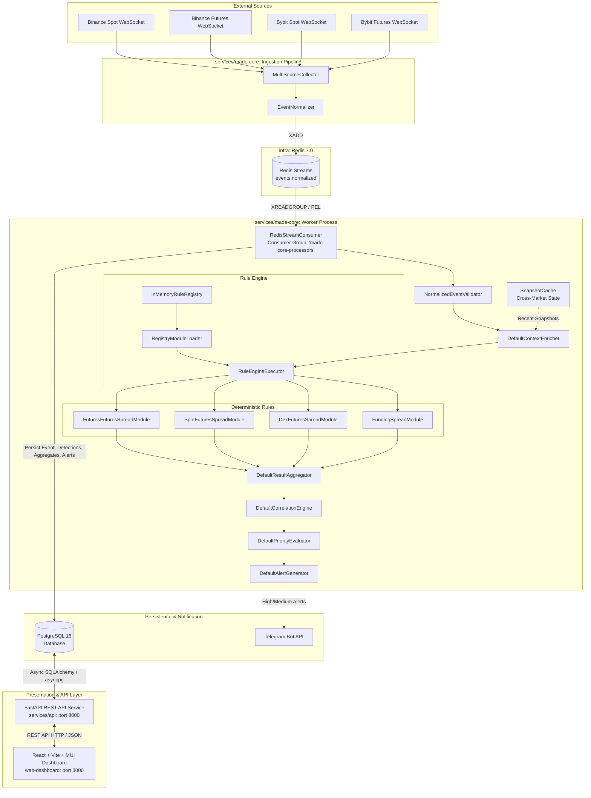

# MADE System Architecture & Component Specification

This document details the high-level and component-level architecture of the **Modular Anomaly Detection Engine (MADE)** in accordance with the requirements for the master's qualification work (Specialty 123 "Computer Engineering").

---

## 1. High-Level System Flow

---

## 2. Component Roles and Boundaries

| Component | Directory / Service | Primary Responsibility | Architectural Rule |
| :--- | :--- | :--- | :--- |
| **Ingestion Pipeline** | `services/made-core/src/made_core/ingestion` | Ingest raw exchange streams, parse tickers, and normalise into canonical `NormalizedEvent`. | Isolated from detection logic; communicates exclusively via Redis Streams. |
| **MADE Core Worker** | `services/made-core/src/made_core/infrastructure/worker.py` | Consumes events from Redis, maintains `SnapshotCache`, enriches context, executes Rule Engine, aggregates results. | Stateless domain logic; no direct framework dependencies in modules. |
| **Detection Modules** | `services/made-core/src/made_core/modules` | 4 MVP deterministic rules: Spot-Futures, Futures-Futures, DEX-Futures, Funding-Spread. | Return `DetectionResult`; cannot create alerts, send notifications, or query DB directly. |
| **Persistence Adapter** | `services/made-core/src/made_core/infrastructure/postgres` | Idempotent persistence of events, detections, aggregates, and alerts into PostgreSQL. | Asynchronous SQLAlchemy 2.0 with connection pooling and Alembic schema management. |
| **FastAPI REST API** | `services/api` | Read-only REST API exposing paginated events, detections, aggregates, alerts, system metrics, and health checks. | Consumes PostgreSQL via `MadeQueryService`; completely decoupled from Core Worker. |
| **Web Dashboard** | `web-dashboard` | React 18 + Vite + TypeScript + Material UI interactive monitoring interface. | Communicates strictly via FastAPI REST API; zero direct connections to DB/Redis. |
| **Experimental Framework** | `experiments` | Scientific benchmarking suite measuring throughput, stratified latencies, fault recovery, and detection correctness. | Fully isolated test harnesses and reproducible seeded generators. |

---

## 3. Data Flow Progression

1. `NormalizedEvent`: Standardized market event from Redis Streams.
2. `EnrichedEvent`: Event augmented with `MarketContext` and recent `MarketSnapshot` items.
3. `DetectionResult`: Standardized output of a single detection module (`NORMAL` or `ANOMALY`).
4. `AggregatedResult`: Combined signals for one candidate anomaly (composite score, triggered modules).
5. `Alert`: Prioritized notification-ready entity (`HIGH`, `MEDIUM`, `LOW`).
